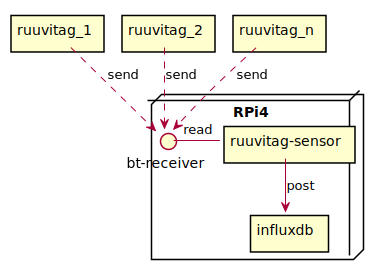

# home-temperatures

## What?

This repository contains plans and (eventual) implementation for RuuviTag based home temperature monitoring system.

## How?

### Main components

- Sensors: RuuviTag, capable of measuring temperature, humidity, pressure etc
- Receiver: RPi4, capable of receiving data from sensors over Bluetooth
